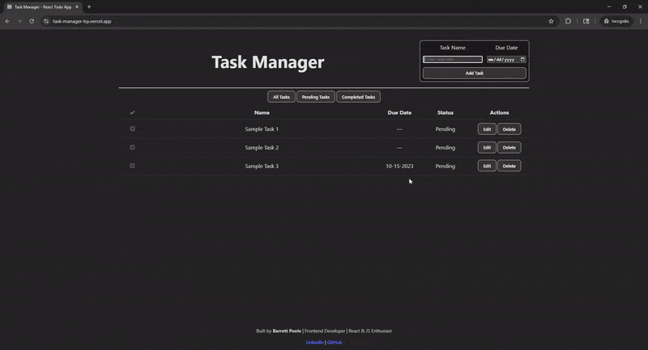

# Task Manager App

A simple **React + Vite Task Manager** application designed to help you add, edit, delete, and track tasks. This project demonstrates **React fundamentals**, component-based architecture, state management, and localStorage persistence.

## Tech Stack

- **React** (Functional Components & Hooks: useState, useEffect)
- **Vite** (Fast development build tool)
- **JavaScript (ES6+)**
- **CSS** for styling
- **localStorage** for client-side persistence
- **Git & GitHub** for version control

---

## Features

- Add new tasks
- Delete tasks
- Edit existing tasks
- Mark tasks as completed
- Persist tasks across browser reloads using localStorage
- Clean and readable component structure

---

## Demo



---

## Getting Started

1. Clone the repository:

```bash
git clone https://github.com/b-poole/task-manager.git
cd task-manager
```

2. Install Dependencies

```bash
npm install
```

3. Start the development server

```bash
npm run dev
```

Open the app in your browser (usually http://localhost:5173/)

## About Me

I’m an aspiring frontend developer building hands-on projects in React to strengthen my skills. Check out my [LinkedIn](www.linkedin.com/in/barrett-poole-630a3a145)
and [GitHub](https://github.com/b-poole)
for more projects.
